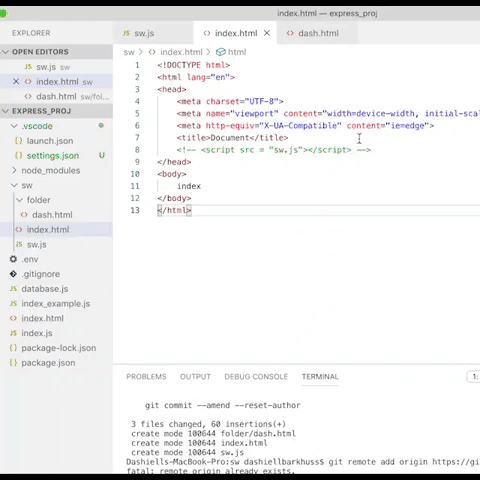

## Day 57, R3
### 9/14/19

- ## Node
  ## Where I Left Off
  Now if the user is not connected to the internet the app collects a timestamp and saves it to local storage. Next I'll handle how it will send the timestamp from local storage to the backend.

  ## Service Workers
  Services workers make your app work offline.

  >A service worker’s primary function is to intercept http calls made by pages and returning cached files.

  -*from [Offline Web Apps: Using Local Storage and Service Workers.](https://medium.com/@onejohi/offline-web-apps-using-local-storage-and-service-workers-5d40467117b9)*

  More resources:

  [Making a Simple Site Work Offline with ServiceWorker](https://css-tricks.com/serviceworker-for-offline/)

  [Offline Quickstart](https://www.youtube.com/watch?v=zw35jKRSIlo)

  [View Cache Data With Chrome DevTools](https://developers.google.com/web/tools/chrome-devtools/storage/cache)

  ## Sample Service Worker App

  I made a sampler service workers app [here](https://github.com/DashBarkHuss/service_worker).

  **Without** the service workers file, `sw.js`, the app can't load pages while offline:

  
  

  **With** the service workers file, `sw.js`,  the app loads specified pages while offline:

  

  ## Where I Left Off
  I learned about service workers so I could use them in my app. I still have to handle sending the local storage to my database.