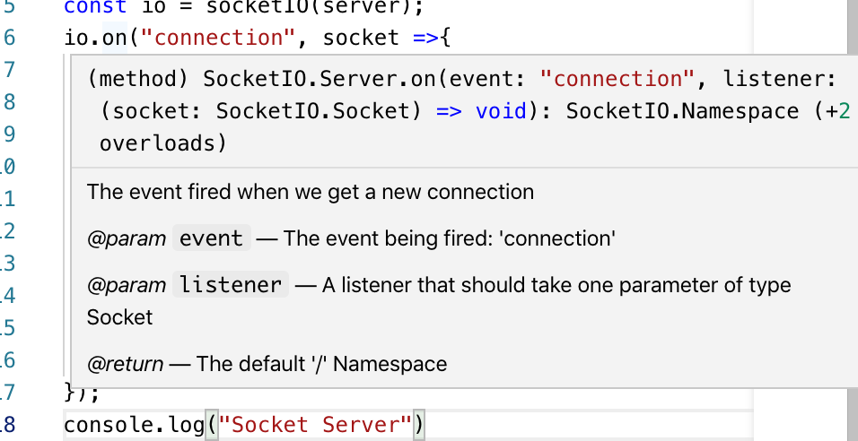

## Day 107, R3
### 11/3/19
- ### Where I Left Off
  I left off on this video: [What is code quality?](https://www.linkedin.com/learning/node-js-testing-and-code-quality/what-is-code-quality)

  ## VSC Tooltips
  I posted this question:
  [Where does VSC get its information that's displayed in the tooltips?](https://stackoverflow.com/questions/58682763/where-does-vsc-get-its-information-thats-displayed-in-the-tooltips)

  When I hover over a method, VSC displays information on that method in a tooltip.

  **Example**: Here, I hover over `.on`, a method I'm using from the Socket IO library. Then I can see documentation on `.on`:


  

  **Question**: Where does VSC grab documentation from to display in the tooltips?

  I couldn't find any of this info in the socket.io package, or any other respective package for different libraries.

  ## [Node.js: Testing and Code Quality](https://www.linkedin.com/learning/node-js-testing-and-code-quality/welcome):

  - Coding Conventions and Standards
  - Linting

  ## Unit Testing
  - **Unit**: Smallest testable part of an application. 
    - can be as big as an interface, or as small as an individual method.
  - **Unit Tests**: Tests an isolated unit via API.
    - Performed in memory: No permanent changes take place.
  - **Unit Test Assertions**: Validates correctness of a unit.

  ```javascript
  // Test setup using Node.js Assert module
  const assert = require(`assert`);
  // Tested Method:
  function cat(){ return 'woof'; }
  // Assertion - actual and expected
  assert.equal(cat(), 'meow')
  ```
  ## Integration Testing
  - Builds on unit tests
  - Combines units and test resulting combinations

  ## Functional Testing
  -  Focus on result, not code
  -  Tests features, not code

  ## System Testing
  - Test application and hosting environment

  ## Where I Left Off
  I left off taking the chapter quiz: [Chapter Quiz](https://www.linkedin.com/learning/node-js-testing-and-code-quality/quiz/59bac6973dd5594664ed3035)


