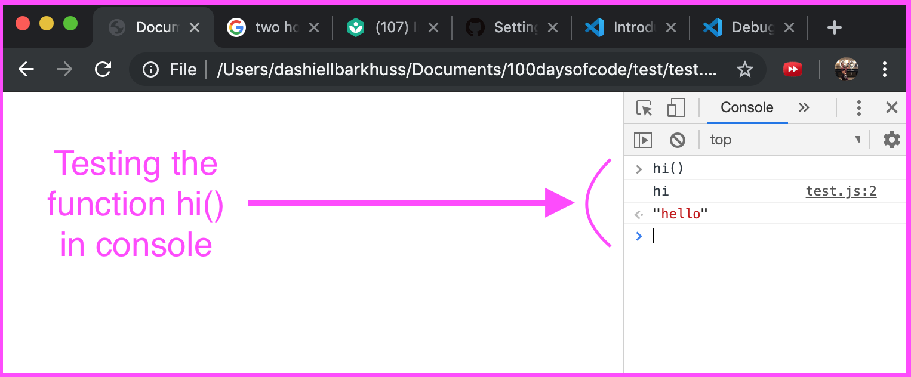

## Day 32, R3
### 8/20/19

- ## Node
  I'm making a vanilla Node.js app with CRUD and sessions.

  ## Where I Left Off:
  Bcrypt isn't working as expected. For some reason it hashes the same token differently each time. I wonder if this has to do with the 'salt' which I didn't look into so much. I'll look more into bcrypt.

  ## Bcrypt `compare()`
  I found out that bcrypt isn't like md5. In Md5 in order to compare a password with a hashed password you'd do something like `md5(password) == hashedPassword`. Hashing a given password with `md5()` will always give the same output. But this isn't true with bcrypt. 

  If I hash a password with bcrypt, and then hash the same password again, I will get two different hashes. So, in bcrypt we use a different function to hash a password than to compare the password to its hashed version.

  The video [Compare Hash Password W/ Node.js & BCrypt](https://www.youtube.com/watch?v=Yc2VKb4_jdY) shows how to do this using the compare method.

  ```javascript
   function compareHash(token, hashedToken, cb){
      return new Promise((reject, resolve)=>{
          bcrypt.compare(token, hashedToken, (err, isMatch)=>{
              if (err){
                  reject(cb(err));
              }
              resolve(cb(null, isMatch));
          });
      });
  };
  ```

  ## Throw vs Reject

  > Any time you are inside of a promise callback, you can use throw. However, if you're in any other asynchronous callback, you must use reject.

  -*[JavaScript Promises - reject vs. throw](https://stackoverflow.com/questions/33445415/javascript-promises-reject-vs-throw)*

  I want to play around in with throw and reject to see the difference.

  ## Return vs. Resolve

  >The rule is, if the function that is in the then handler returns a value, the promise resolves/rejects with that value, and if the function returns a promise, what happens is, the next then clause will be the then clause of the promise the function returned, 

  -*[What's the difference between returning value or Promise.resolve from then()](https://stackoverflow.com/questions/27715275/whats-the-difference-between-returning-value-or-promise-resolve-from-then)*

  ## Debugging
  I'm trying to figure out what type of object bcrypt.compare returns and if it's asynchronous.

  On the browser, I'd just use the console to look into this. But how do I do it with node.js? 

  Using just console.log statements and test functions is ok. But there must be a better way.

  If I have a function `hi()` that's in a javascript file available to the client, I can test that in DevTools right in the console:

  

  Is there a way to do this with vsc and node.js? Can I run a function in a node.js project directly from some console?

  Someone recommended I try I [Quokka](https://quokkajs.com/docs/index.html).

  ## Where I Left Off:
  I got bcrypt to recognize when a password matches a hashed password but I didn't put that function in the verify endpoint yet. That's what I'll do tomorrow.

  [Link To Work](https://github.com/DashBarkHuss/crud_login_node_app/commit/bdd36e71fcab50af943405b0b6464af7be4f4307)