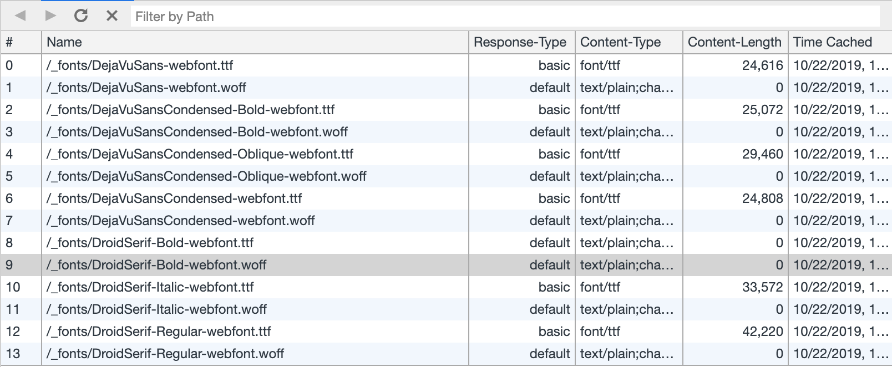
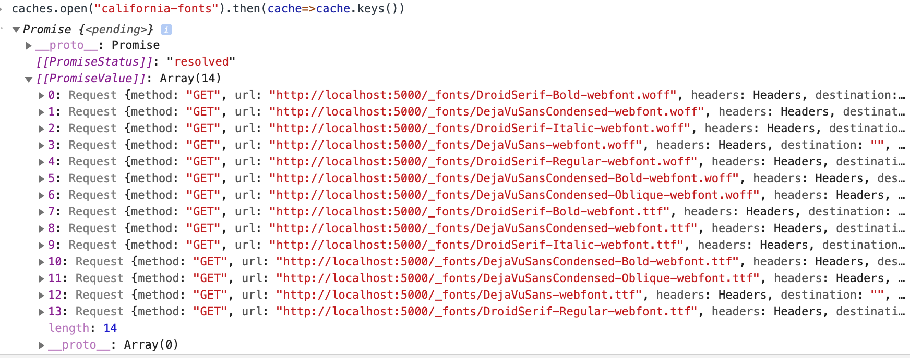

## Day 95, R3
### 10/22/19

- ## Node
  ### Where I Left Off
  ## Where I Left Off
  I ended trying to get the service worker to retrieve the cached css when offline. Somehow, while I have `offline` checked in devtools it's still fetching and updating the css. I started to isolate the issue here to see the problem better.

  ## Problem Disappeared
  So I have no clue what happened. I went back to work on the issue and now the issue is gone.

  ## `Cache.put`

  >The put() method of the Cache interface allows key/value pairs to be added to the current Cache object.
  >...
  >Syntax
  >```javascript
  >cache.put(request, response).then(function() {
  >// request/response pair has been added to the cache
  >});
  >```
  >**Parameters**
  >
  >**request**
  >
  >The Request object or URL that you want to add to the cache.
  >
  >**response**
  >
  >The Response you want to match up to the request.
  
  -from [Cache.put() - Web APIs | MDN](https://developer.mozilla.org/en-US/docs/Web/API/Cache/put)

  I'm confused, what's the difference between the *"The Request object or URL that you want to add to the cache."* and the *"The Response you want to match up to the request."*
  
  >**The difference between add and put**
  >
  >It’s a trick question! As it turns out, add and addAll use put under the hood.
  >
  >It works like this:
  >1. For each request in the array (or a single request in the case of `add`), do a fetch
  >2. Add the response to a key-value pair list, with the request as the identifying key
  >3. Cache the request _and_ response together (by using put)

  -from [Cache Storage: What's the difference between cache.add and cache.put?](https://carmalou.com/lets-take-this-offline/2019/04/23/whats-the-difference-between-add-and-put.html)

  This helps clarify. But when I look at my cache storage I don't see anything about a key value pair?

  

  I wonder how you can see the key-value pair list?

  ## Cache Keys

  I was able to find the keys with the code
  ```javascript
  caches.open(cacheName).then(cache=>cache.keys())
  ```
  

  ## Where I Left Off
  Tomorrow, I'll see if I change the request in caches.put, if I get different keys. I'm trying to see exactly what the request in a cache does. I tried changing the request to a different URL, "http://localhost:5000/dash". But then when I went to that url I expected it to give the response that I cached with it, but it didn't.