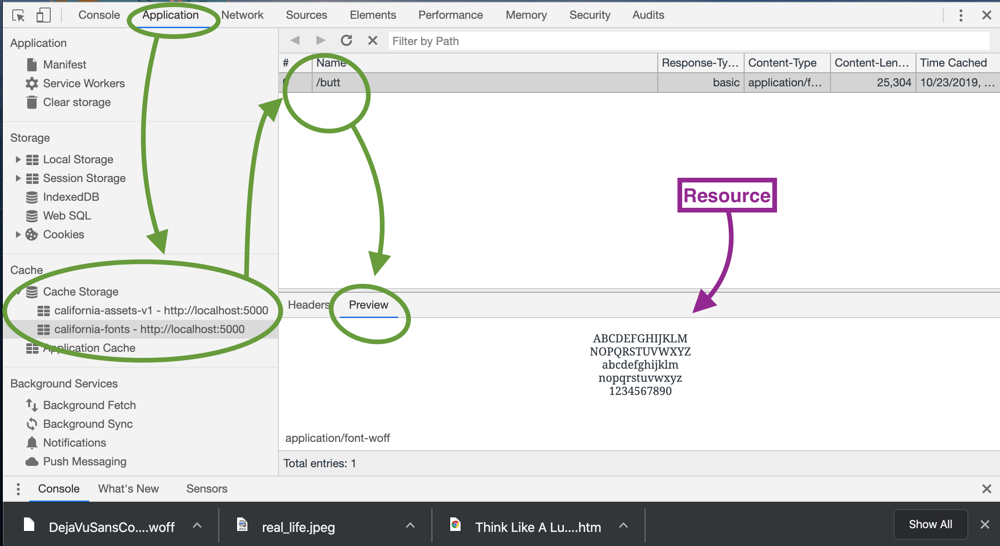

## Day 96, R3
### 10/23/19
- ## Node
  ### Where I Left Off
  Today, I'll see if I change the request in caches.put, if I get different keys. I'm trying to see exactly what the request in a cache does. I tried changing the request to a different URL, "http://localhost:5000/dash". But then when I went to that url I expected it to give the response that I cached with it, but it didn't.
  
  ## New Line In The Console
  How do you make a line in the console so your code is not on one line? If you press return, your code gets run. So what are you supposed to do?

  **Answer:** `shift` +`enter`

  ## Understanding `Cache.put`

  ```javascript
  caches.open('california-fonts')
  .then(cache => {
      var buttReq = new Request('/butt');
      cache.put(buttReq, someNetWorkResponse);
  ```
  Now if we go to `localhost:5000//butt`, we'll get the cached file that was `someNetworkResponse`.

  I thought this didn't work for a while because I trying to make the request like this:
  ```javascript
  var buttReq = new Request(event.request);
  butReq.url = "http://localhost:5000/butt"
  ```

  But that didn't actually change the url of the request. I'm not sure why.

  ## How To See Values Of the Cache?
  If I can see the keys of the cache with `.keys()`, how can I see the values?

  I tried to get the value using bracket notation, but this didn't work. The value (response) was undefined.

  ```javascript
  var request;
  caches.open("california-fonts")
  .then(cache=>cache.keys())
  .then(keys=>{
      request=keys[0];
  })
  request // Request {method: "GET", url: "http://localhost:5000/butt", headers: Headers, destination: "", referrer: "", …}
 
  var response;
  caches.open("california-fonts")
  .then(cache=>{
      response=cache[request];
  })
  response //undefined
  ```

  ## DevTools: View Cache Values
  Here's how you can see the cache values in DevTools. 
  
  Click on the green circled buttons:

  

  More info: [View Cache Data With Chrome DevTools](https://developers.google.com/web/tools/chrome-devtools/storage/cache)

  Not sure how to find them programmatically.

  ## Where I Left Off:
  I'm following along with the LinkedIn Service Workers Tutorial. I'm on this video: [Use stale-while-revalidate](https://www.linkedin.com/learning/vanilla-javascript-service-workers/use-stale-while-revalidate?autoplay=true)