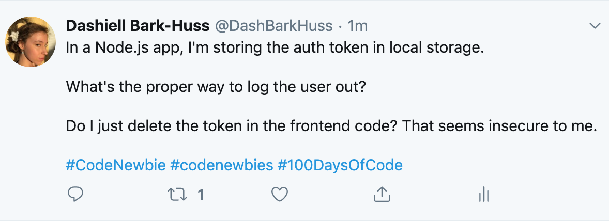

## Day 15, R3
### 8/3/19

- ## Node
 
  ### Where I left off:
  I'm making a Node app that has a login.

  I started to add the login UI but it's not working yet.

  ## Login UI
  I got the login UI working.

  [Link To Work](https://github.com/DashBarkHuss/node_server_sessions/commit/057aeb7e17f681c72e409413258bf9460083bc5a)

  ## Storing Client Login Info
  I thought it might be good for security reasons to keep track of which devices each auth token is being stored on. So I wanted to know how to access information about the client.

  [How to determine a user's IP address in node](https://stackoverflow.com/questions/8107856/how-to-determine-a-users-ip-address-in-node)

  [How to get information about the client in node.js](https://stackoverflow.com/questions/3895434/how-to-get-information-about-the-client-in-node-js)

  ```javascript
  console.log(request.connection.remoteAddress); //127.0.0.1
  console.log(request.headers['user-agent']); //Mozilla/5.0 (Macintosh; Intel Mac OS X 10_14_6) AppleWebKit/537.36 (KHTML, like Gecko) Chrome/75.0.3770.142 Safari/537.36
  ```
  I could save this information in the sessions table. But what if the user deletes the local storage on their own without pressing the logout button? Then I'd have devices in the sessions table that say they are logged in but aren't. So maybe it's not a good idea. 

  I also need to think about how I need to change my code to prevent multiple logins of different users on the same client.

  ## `localStorage` Syntax
  [Window.localStorage](https://developer.mozilla.org/en-US/docs/Web/API/Window/localStorage)
  ```javascript
  localStorage.setItem('myCat', 'Tom');
  var cat = localStorage.getItem('myCat');
  localStorage.removeItem('myCat');
  localStorage.clear();
  ```

  ## Secure Logout
  Right now I have the logout function on the frontend.

  ```javascript
  const logout = (payload) => {
    localStorage.removeItem('token');
  }
  ```

  This doesn't seem secure. What if someone changes the javascript so that it just looks like it logs out but the token doesn't delete? I'm not sure if that's possible but It seems like it is.

  I did some research but was having trouble finding an answer so I posted on twitter:

  

  I got an [answer](https://twitter.com/the_moisrex/status/1157687913448165376) from [@moisrex](https://twitter.com/the_moisrex). Basically, what I had a few days ago was correct. You ***do*** delete the session from the database when the user logs out. So you *can* have ***multiple*** sessions for each user. Different devices will have different sessions for the same user in order to log out separately. Otherwise, logging out on your phone would also log you out of your computer.

  I thought this was wrong  because in [Node.js – Server Setup](https://www.patreon.com/posts/node-api-source-27588087), **Greg only has *one* session per user:**
 
  In `action_create_session` of the github file, the session is found by the `user_id`.
  
  [Node.js – Server Setup Github](https://github.com/javascriptteacher/node/blob/master/module/api/api.js) Code:
  ```javascript
  database.connection.query("SELECT * FROM session WHERE user_id = '" + payload.id + "' LIMIT 1",
        (error, results) => { // Check if session already exists
  ```

  If we're just searching by `user_id`, that would mean there's only ***one*** auth token per each user. But we will actually need to look up the token by `username` and `user.agent` and `IP`, because there may actually be multiple sessions per user.

  I think [@moisrex](https://twitter.com/the_moisrex)'s way is correct. It makes more sense to me. Also Greg told me the Node book is still a work-in-progress so it's possible his query is just a mistake. Or maybe it's just a simplified way to create a session for learning purposes.

  ## Changing Session
  Now I have to go back and change how the app creates the session.

  I changed the query. Before, I was just searching for `username`. Now it also looks for `user-agent` and `ip`:

  ```javascript
  // line 74, api.js `action_session_create`
  let q = `select * from session where username = '${payload.username}' AND ip = ${request.connection.remoteAddress} AND user-agent = ${request.headers['user-agent']}` ;
  ```

  This is where I left off. I'll continue working on `action_session_create` tomorrow.